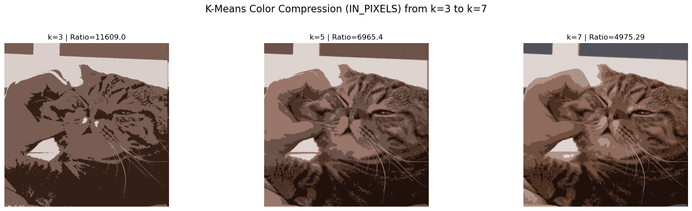
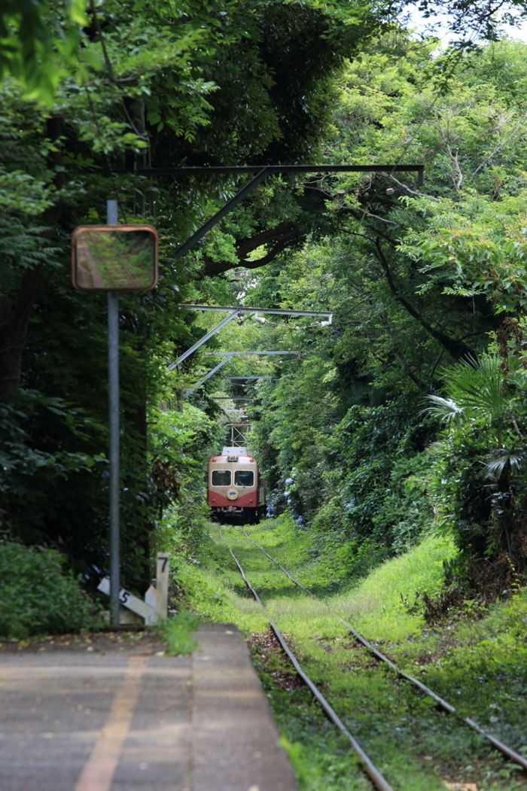

---

 
 
 
<h1 style="font-size:80px">Project report</h1>
<h6 style="font-size:20px">Applied Mathematics and Statistics</h6>
 
 
 

  

    <h5>Title:  </h5>
    <h5>Author:  </h5>
    <h5>Student ID:   </h5>
    <h5>Class:  </h5>
  

  

  

  

    <h5>Color Compression Project</h5>
    <h5>Lê Anh Duy</h5>
    <h5>23127011</h5>
    <h5>23CLC03</h5>
  

---

---

## 
<h3>Table of contents</h3>

- [1.  Project Idea](#1--project-idea)
  - [1.1. Overview](#11-overview)
  - [1.2. Input and Output](#12-input-and-output)
  - [1.3. Objectives](#13-objectives)
  - [1.4. Approach](#14-approach)
    - [Classical Approach](#classical-approach)
    - [Other Approaches](#other-approaches)
- [2. Implementation Details](#2-implementation-details)
- [3. Results and Conclusion](#3-results-and-conclusion)
  - [3.1. Color Reduction Summary](#31-color-reduction-summary)
      - [Example 1: Image with major colors (k= 7, number of iterations = 100)](#example-1-image-with-major-colors-k-7-number-of-iterations--100)
      - [Example 2: Natural Scene Image (image with complex colors, k = 7, number of itterations = 100)](#example-2-natural-scene-image-image-with-complex-colors-k--7-number-of-itterations--100)
  - [3.2. Visual Assessment](#32-visual-assessment)
      - [**Posterization**](#posterization)
  - [3.3. Algorithm Efficiency](#33-algorithm-efficiency)
    - [3.3.1. Random Initialization](#331-random-initialization)
    - [3.3.2. In Pixels Initialization](#332-in-pixels-initialization)
    - [3.3.3. K-Means++ Initialization](#333-k-means-initialization)
    - [3.3.4. Maximin Initialization](#334-maximin-initialization)
  - [4. References](#4-references)
    - [Image Sources](#image-sources)
    - [Algorithm \& Mathematical Concepts](#algorithm--mathematical-concepts)
- [5. Acknowledgements](#5-acknowledgements)
  - [5.1. AI Contributions](#51-ai-contributions)
  - [5.2. Testing and Validation](#52-testing-and-validation)

---

# 1.  Project Idea
## 1.1. Overview
The project aims to implement a color compression algorithm that reduces the number of colors in an image while preserving its visual quality. The algorithm will be based on the K-means clustering technique, which groups similar colors together and replaces them with a representative color from the cluster.
## 1.2. Input and Output

The input to the algorithm will be the path to an image file. The output will be a compressed image with a default number of colors defined in the `main` function. The user can also specify the number of colors to compress the image to by changing the `k_cluster` variable in the `main` function or make the algorithm run with more iterations by changing the `max_itter` variable. 

## 1.3. Objectives
The main objectives of the project are:
- To implement a color compression algorithm using K-means clustering.
- To evaluate the performance of the algorithm in terms of compression ratio and visual quality.
- Compare the results of different initialization strategies for K-means clustering, such as random initialization, Maximin initialization, and K-Means++ initialization.

## 1.4. Approach
### Classical Approach
The classical approach to color compression involves the following steps:
1. Load the image and convert it to a suitable color space (e.g., RGB).
2. Reshape the image data from 3D array $[w, h, 3]$ into a 2D array $[w \times h, 3]$ of pixels, now each pixel is considered a vector $v \in \R^3$.
3. Apply K-means clustering to group similar colors together.

K-means clustering implements the following steps:
1. Initialize K cluster centroids, $c_1, c_2, ..., c_k, \forall c_i \in \R^3$, randomly as follow:
   1. if `init_centroids='random'`, randomly select K colors values as intial centroids.
   2. if `init_centroids='in_pixel'`, randomly select K pixels from the image as initial centroids.
2. Assign each pixel to the nearest centroid based on the Euclidean distance in RGB space with the formula, $\forall v_j \in \text{pixels}, c_i \in \text{centroids}$:
   \[
   ||v_j - c_i|| = \sqrt{(R_j - R_i)^2 + (G_j - G_i)^2 + (B_j - B_i)^2}
   \]

3. Update the centroids by calculating the mean of all pixels assigned to each centroid:
   \[
   c_i = \frac{1}{N_i} \sum_{v_j \in C_i} v_j
   \]
   where $C_i$ is the set of pixels assigned to centroid $c_i$ and $N_i$ is the number of pixels in $C_i$.

4. Repeat steps 2 and 3 until convergence (i.e., centroids do not change significantly) or until a maximum number of iterations is reached.
5. Replace each pixel in the image with the color of the nearest centroid.

With the above steps, the algorithm will produce a compressed image with a reduced number of colors. The complexity of the algorithm is $O(n \cdot k \cdot d \cdot m)$, where $n$ is the number of pixels, $k$ is the number of clusters, $d$ is the dimensionality of the color space (3 for RGB), and $m$ is the number of iterations.

### Other Approaches

Choosing the right starting points, or **initial centroids**, is incredibly important for how well the K-means algorithm performs. A good set of initial centroids can lead to faster convergence and more accurate, stable clusters. Conversely, poor choices can result in suboptimal clusters or the algorithm getting stuck in a local optimum.

To tackle this challenge, several initialization strategies have been developed. Two of the most widely used and effective methods include:

**Maximin Initialization:**
This method iteratively selects centroids that are maximally distant from those already chosen, promoting dispersion across the data space and improving clustering stability.

**K-Means++:**
Proposed by Arthur and Vassilvitskii (2007), K-Means++ builds on the Maximin idea by introducing a probabilistic selection mechanism based on squared distances. This approach further reduces the likelihood of poor initialization and accelerates convergence.

K-Means++ can be viewed as a probabilistic refinement of Maximin, balancing dispersion with robustness.

---

# 2. Implementation Details

The project is a Python-based color compression tool built using a custom K-Means algorithm. It leverages **NumPy** for array computations, **Pillow** for image input/output, and **Matplotlib** for visualization and output generation. For table generation, **Pandas** is used to create a structured summary of the results.

The core workflow and the primary functions used are as follows:

1.  **Image Preprocessing**
    The input image is loaded from a file and its data is transformed from a 3D array (height, width, channels) into a 2D array where each row represents a single pixel's color values. This standardized format is required for the clustering algorithm.
    *   **Key Functions:** `read_img` loads the image file, and `convert_img_to_1d` performs the crucial reshaping operation.

2.  **K-Means Clustering**
    A from-scratch K-Means algorithm groups the pixels into `k` color clusters. The implementation is flexible, supporting four distinct strategies for placing the initial centroids: `random`, `in_pixels`, `K-Means++`, and `maximin`. The algorithm then iteratively assigns pixels to the nearest centroid and updates the centroid's color to the cluster's average until convergence.
    *   **Key Function:** The entire clustering process is encapsulated within the `kmeans` function, which internally calls helpers like `initialize_centroids_kmeanspp` and `initialize_centroids_maximin` for the advanced initialization strategies.

3.  **Image Reconstruction**
    A new, color-compressed image is created by replacing each pixel's original color with the color of the final centroid of the cluster it belongs to. This 1D array of new pixel colors is then reshaped back into the original image's 2D dimensions.
    *   **Key Function:** This is performed by the `generate_2d_img` function, which uses the final `centroids` and `labels` returned by the K-Means algorithm to build the new image.

4.  **Automated Comparative Analysis and Visualization**
    To systematically evaluate the performance and results of the different initialization methods, a comprehensive testing and visualization pipeline was created. This process generates a side-by-side comparison figure for each of the four methods. Each figure contains the compressed image on one side and its corresponding analytical cluster plot on the other.
    *   **Key Functions:**
        *   **`test_all`:** This is the main orchestration function. It takes an image path, iterates through all four initialization methods, runs the entire pipeline for each, and saves the final comparison images to disk.
        *   **`plot_clusters_on_ax`:** A modified version of the original plotting function, redesigned to draw its PCA cluster visualization onto a specific Matplotlib subplot (`ax`). This modification is critical for creating the combined side-by-side output figure.
        *   **`plt.savefig`:** Used within `test_all` to save the final Matplotlib figure, containing both the compressed image and the plot, as a single PNG file.

---

# 3. Results and Conclusion

This section presents the results of applying the K-means algorithm for image color quantization with different values of `k` (e.g., 3, 5, 7). The test images were selected to represent various characteristics such as flat colors, natural scenes, and noisy textures.

The visual outcomes are compared against the original images to evaluate how well the algorithm preserves structure and reduces color complexity. Key observations and conclusions are summarized at the end of the section.

To evaluate the effectiveness of the K-means algorithm for image color quantization, several key aspects were considered. For clarity and simplicity, the evaluation criteria were grouped into three main categories:

1. **Color Reduction Summary**  
   Measures how effectively the number of colors in the original image is reduced while preserving overall structure. This includes the compression ratio, number of clusters (`k`), and visual presentation of the resulting color palette.

2. **Visual Assessment**  
   Provides a subjective comparison between the original and quantized images. The goal is to evaluate how well the algorithm preserves the essential visual characteristics, such as color gradients, object boundaries, and recognizability.

3. **Algorithm Efficiency**  
   Focuses on performance metrics such as the number of iterations to converge, and the influence of different centroid initialization strategies (`random`, `in_pixels`, etc.).

By using **PCA** for dimensionality reduction, the results are visualized in a 2D space, allowing for a clearer understanding of how the clusters are formed and how well the algorithm captures the color distribution of the original image.

## 3.1. Color Reduction Summary
**Experiment results**

We will conduct experiments with different values of `k` (5, ..., 60) to observe how the K-means algorithm compresses the color palette of images.

#### Example 1: Image with major colors (k= 7, number of iterations = 100)

    

      
        <h5>Cat Image</h5>
  

  

      
      <h5>Flat Design Image</h5>
  

Running the K-means algorithm with `k=5` through `k=60` on the cat image yields the following results:

We can observe that as `k` increases, the algorithm captures more detail in the image. But in the random initialization, at `k=7` the results are visually similar to `k=5`, indicating diminishing returns in visual quality, while the Maximin, K-Means++ and Randomly Choosing the pixels in the image initialization strategies continue to show improvements in color representation.

For further analysis, we can plot the color distribution of the clusters in a 2D PCA space to visualize how well the algorithm captures the color palette of the image. Here is the PCA plot for the cat image with `k=7` of the algorithm using the `random` initialization strategy compared to the others:

We see that there are clusters `0, 2, 3` in the cat image and clusters `0, 1, 3` in the flat design image do not have any pixels in the PCA plot, indicating that image do not have any color near these centroids. This is because the `random` initialization strategy chooses colors randomly, and in this case, it chose colors that are not present in the image.

While the other initialization strategies, such as `K-Means++` and `Maximin` and choosing the pixels in the image, show a more balanced distribution of colors, capturing the major colors in the image effectively.

#### Example 2: Natural Scene Image (image with complex colors, k = 7, number of itterations = 100)

With image has complex and diverse colors, the K-means algorithm with random initialization usually captures the major colors in the image and don't show any significant difference compared to the other initialization strategies. Here I comapre the random choosing collors with the randomly choosing pixels in the image initialization strategies (I found the other 2 strategies do not show any significant difference in this case):

**Conclusion**

The K-means algorithm effectively reduces the color palette of images while preserving essential visual characteristics. As `k` increases, the algorithm captures more detail, but the diminishing returns in visual quality suggest that a moderate `k` (e.g., 7-9) is often sufficient for us to get the idea and the overall color distribution of an images.

The choice of centroid initialization strategy significantly impacts convergence speed and final cluster quality. **Although the random initialization usually converges faster than others, it can lead to suboptimal results.**
> In cases where the image has a color palette with distinct clusters, the **random initialization** may not capture the full range of colors effectively, leading to a less visually appealing or missing major colors in the image.

Other strategies like K-Means++ and Maximin initialization provide more stable and visually appealing results, especially for complex images.

## 3.2. Visual Assessment
We will conduct a visual assessment of the compressed images by comparing them to the original images. The goal is to evaluate how well the K-means algorithm preserves the essential visual characteristics, such as color gradients, object boundaries, and recognizability. We will conduct the experiment on a landscape image with diverse colors, k = {5, 7, 9, 11}, number of itterations = 50

  

      
      <h5>Original Image</h5>
  

  

      
      <h5>Sorted Image</h5>
  

After sorting the colors in the original image, we can see that the image has a diverse color palette with many different colors. And they smoothly transition from one color to another, which is a characteristic of natural scenes. Now, we can apply the K-means algorithm to compress the image and observe the results.

We can clearly see that, as `k` increase, the color palette of the compressed image becomes more dynamic as the **color gradients and transitions are better preserved.**

#### **Posterization**

  

      
      <h5>Original Image</h5>
  

  

      
      <h5>Sorted Image</h5>
  

When $k$ is too low, the algorithm may produce a posterized effect, where large areas of the image are reduced to a few flat colors. This can lead to a loss of detail and visual quality, as seen the experiment conducted on portrait image below:

## 3.3. Algorithm Efficiency

In this section, we will evaluate the efficiency of the K-means algorithm in terms of convergence speed and the impact of different centroid initialization strategies on the number of iterations required to reach convergence.

To evaluate the convergence behavior of the K-Means algorithm, we track the change in centroid positions at each iteration. Specifically, we compute the **Frobenius norm** between the centroids of the current and previous iterations:

\[
\delta = \left\| C^{(t)} - C^{(t-1)} \right\|_F = \sqrt{\sum_{i=1}^{k} \sum_{j=1}^{c} \left( c_{ij}^{(t)} - c_{ij}^{(t-1)} \right)^2}
\]

Where:
- \( k \) is the number of clusters,
- \( c \) is the number of color channels (typically 3 for RGB),
- \( C^{(t)} \) and \( C^{(t-1)} \) are the centroid matrices at iterations \( t \) and \( t-1 \) respectively.

> In this implementation this delta value is simply calculated as the **Euclidean distance** `delta = np.linalg.norm(new_centroids - centroids)` between the centroids of the current and previous iterations, which is equivalent to the Frobenius norm for this case.         

This delta value represents the total shift in all cluster centroids from one iteration to the next. A **smaller delta** indicates the centroids are stabilizing, and the algorithm is converging.

We plot the delta values over iterations for multiple values of `k` to analyze:
- **How quickly the algorithm converges** (convergence speed),
- **How stable the solution is** depending on the number of clusters,
- The effectiveness of the chosen **initialization strategy** (in this case, `in_pixels`).

The convergence curves for each `k` help visually compare the performance and stability of the clustering process across different complexity levels.

We will conduct experiments with the below landscape image with diverse colors, k = {5, 7, 9, 11}, number of itterations = 100.

### 3.3.1. Random Initialization

Despite of having the fastest convergence speed (as the graph is rapidly stabilizing), the random initialization strategy can lead to suboptimal results, especially in cases where the image has a color palette with distinct clusters. The algorithm may converge to a local minimum, resulting in a less visually appealing or missing major colors in the image.

### 3.3.2. In Pixels Initialization

The in pixels initialization strategy provides a more stable and visually appealing result compared to the random initialization (The graph shown stable transition in the convergence). It captures the major colors in the image effectively, but it may take longer to converge due to the increased number of iterations required to find the optimal centroids.

### 3.3.3. K-Means++ Initialization

By strategically selecting initial centroids that are far apart from each other, K-Means++ aims to improve the convergence speed, stability, and final clustering quality.

### 3.3.4. Maximin Initialization

The maximin initialization strategy selects initial centroids by maximizing the minimum distance between them. As shown in the graph below, The first few itterations show a pretty similar centroids shift regardless of the value of `k`, also the convergence speed is not really stable, but it is still better than the random initialization strategy. The algorithm converges to a stable solution, but it may take longer to converge compared to the K-Means++ initialization strategy.

---
---

## 4. References

### Image Sources
- **Landscape (small)**: [Pinterest - Scenic Mountain View](https://www.pinterest.com/pin/4081455904980527/)
- **Landscape (high-res)**: [Backiee - Pragser Wildsee, Italy](https://backiee.com/wallpaper/pragser-wildsee-italy/75697)
- **Portrait**: [Unsplash - Casual Portrait](https://unsplash.com/photos/mans-grey-and-black-shirt-ILip77SbmOE)
- **Flat Design Illustration**: [Creative Boom - Mid-century Graphic Style](https://www.creativeboom.com/inspiration/the-simple-life-cool-graphic-illustrations-that-celebrate-mid-century-design/)
- **Cat Image**: [Pinterest - Cat Photo](https://kr.pinterest.com/pin/1050886894274323973/)

### Algorithm & Mathematical Concepts
- **K-Means++ Initialization**: [Arthur & Vassilvitskii (2007) – k-means++ Paper](https://theory.stanford.edu/~sergei/papers/kMeansPP-soda.pdf)
- **Maximin Initialization**: [MinMax k-Means – Pattern Recognition (2014)](https://www.sciencedirect.com/science/article/abs/pii/S0031320314000338#:~:text=MinMax%20k%2DMeans%20constitutes%20a,assignments%2C%20through%20an%20iterative%20procedure.)
- **K-Means Clustering (Overview)**: [Wikipedia – K-means Clustering](https://en.wikipedia.org/wiki/K-means_clustering)
- **Frobenius Norm (Mathematical Basis)**: [Wolfram MathWorld – Frobenius Norm](https://mathworld.wolfram.com/FrobeniusNorm.html)
---

# 5. Acknowledgements
## 5.1. AI Contributions
I would like to acknowledge the contributions of AI tools, ChatGPT, which assisted in generating code snippets, providing explanations, and suggesting improvements to the algorithm and paraphrasing text. The AI's ability to quickly generate and refine code has significantly accelerated the development process and enhanced the overall quality of the project.

## 5.2. Testing and Validation
The images used in this project were sourced from various online repositories, including:

The testing platforms used for this project include:
- Google Colab: For running the K-means algorithm and visualizing the results.
- My local machine: For running the K-means algorithm and visualizing the results.

I guarantee that the images used in this project are either public domain or have been obtained with permission for educational and research purposes. And all the experiments included in this report were conducted by me, and the results are original and not plagiarized from any other sources. 

The results can be reproduced by running the code provided in by the nodebook `23127011.ipynb`.

The images used in this project are available in my repository [here](https://github.com/Le-Anh-Duy/ApplyMath/tree/main/Proj_01) and can be accessed by anyone who wants to reproduce the results.